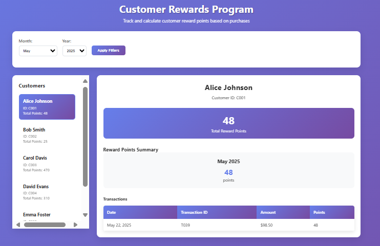
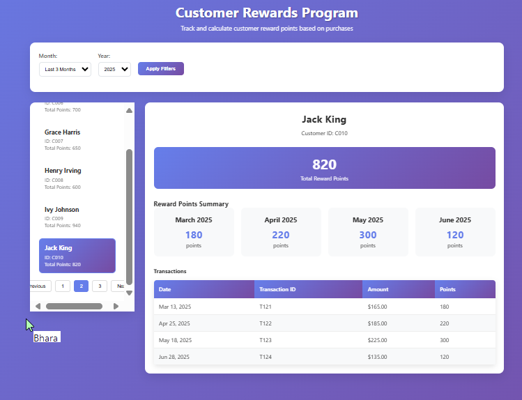
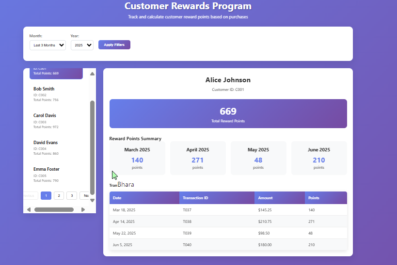
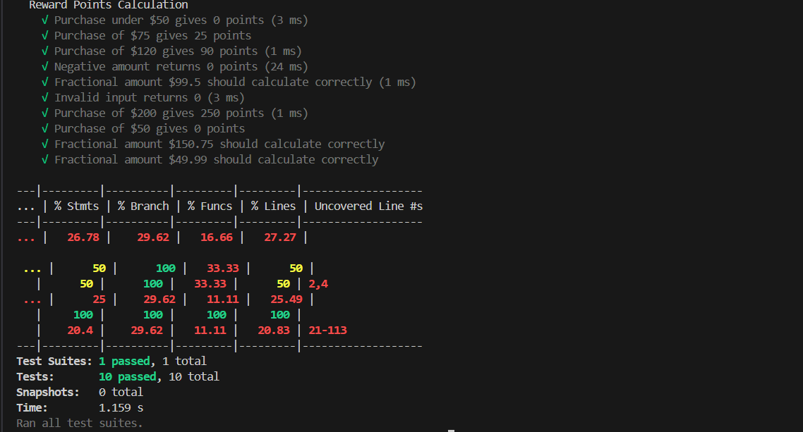

# Customer Reward Program

## 📌 Project Description

A retailer offers a **rewards program** to its customers, awarding points based on each recorded purchase.
Customers earn points as follows:

* **2 points** for every dollar spent **over \$100** in a transaction.
* **1 point** for every dollar spent **between \$50 and \$100**.
* Example: a **\$120 purchase** = `2×20 + 1×50 = 90 points`.

This application calculates reward points **per transaction, per month, and total per customer** for a three-month period.

---

## 🚀 Features

* **Vanilla JavaScript** (no frameworks).
* **Local JSON mock file** simulating API calls.
* **Async API handling** with loading & error states.
* **Dynamic UI**:

  * Customer list with pagination / dropdown / table.
  * Reward points per month.
  * Total reward points per customer.
  * Transaction details per selected month.
* **Month & Year filter** (2021–2025).
* **No transactions** message for empty results.
* **Unit Testing (Jest)**:

  * 3 positive & 3 negative test cases.
  * Includes whole & fractional value tests.
* **Logging with Pino**.
* **Clean UI with CSS**.

---
## 📸 Screenshots





```

---

## 📝 JSON Data (`transactions.json`)

```json
[
  {
    "customerId": "C001",
    "transactionId": "T1001",
    "amount": 120,
    "date": "2025-01-15"
  },
  {
    "customerId": "C001",
    "transactionId": "T1002",
    "amount": 75,
    "date": "2025-02-10"
  },
  {
    "customerId": "C002",
    "transactionId": "T2001",
    "amount": 200,
    "date": "2025-03-05"
  }
]
```

---

## ⚙️ Setup & Run

### 1. Install Required Tools
- Download & install Node.js → [https://nodejs.org](https://nodejs.org)  
- Download & install Visual Studio Code (VS Code) → [https://code.visualstudio.com](https://code.visualstudio.com)  

### 2. Get the Project Code
- Open VS Code  
- Press `Ctrl + Shift + P` (Windows/Linux) or `Cmd + Shift + P` (Mac) to open the Command Palette  
- Type `Git: Clone` and select it  
- Paste this repository URL:  

  ```bash
  https://github.com/KondariNaveen783/customer-reward-program.git
````

* Choose a folder and open the project in VS Code

### 3. Install Project Dependencies

Open a terminal in VS Code (Top Menu → Terminal → New Terminal) and run:

```bash
npm install
```

### 4. Install Live Server Extension

* In VS Code, go to the Extensions panel (left sidebar → square icon).
* Search for **Live Server** (by Ritwick Dey).
* Click **Install**.

### 5. Open the Application

**Option A: Go Live Button**

* At the bottom-right corner of VS Code, click the **“Go Live”** button.
* Your browser will automatically open and show the application.

**Option B: Command Palette**

* Press `Ctrl + Shift + P` (Windows/Linux) or `Cmd + Shift + P` (Mac)
* Type `Live Server: Open with Live Server`
* Select the file `index.html`

**Option C: Manual Open (without Live Server)**

* Open the project folder
* Double-click `index.html` to open it in your browser
* (Refresh manually after changes)

```

4. Run tests:

   ```bash
   npm test
   ```

---

## 🧪 Unit Tests

* Positive test cases (e.g., \$120 = 90 points).
* Negative test cases (e.g., \$0 = 0 points).
* Handles fractional & whole numbers.

---

## 🛠️ Logging

This project uses **Pino** for logging.

Example usage:

```js
import logger from "./logger.js";

logger.info("Transaction processed.");
logger.error("API call failed.");
logger.warn("No transactions for selected filter.");
```

---

## 📅 Filters

* **Months:** January → December.
* **Years:** 2021 → 2025 (default = 2025).
* Default filter = last 3 months.
